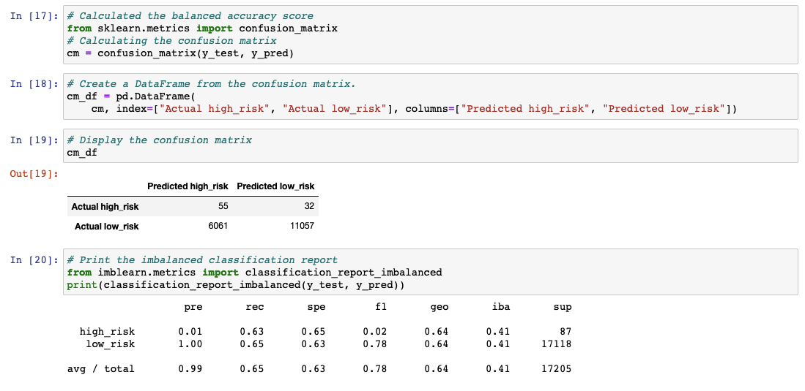
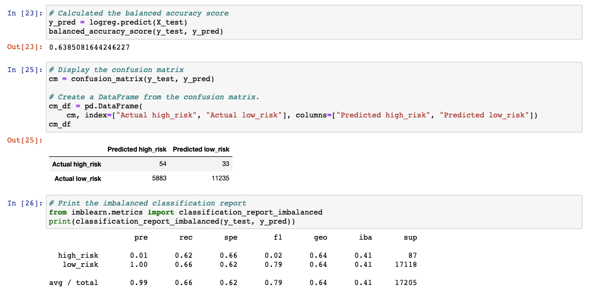
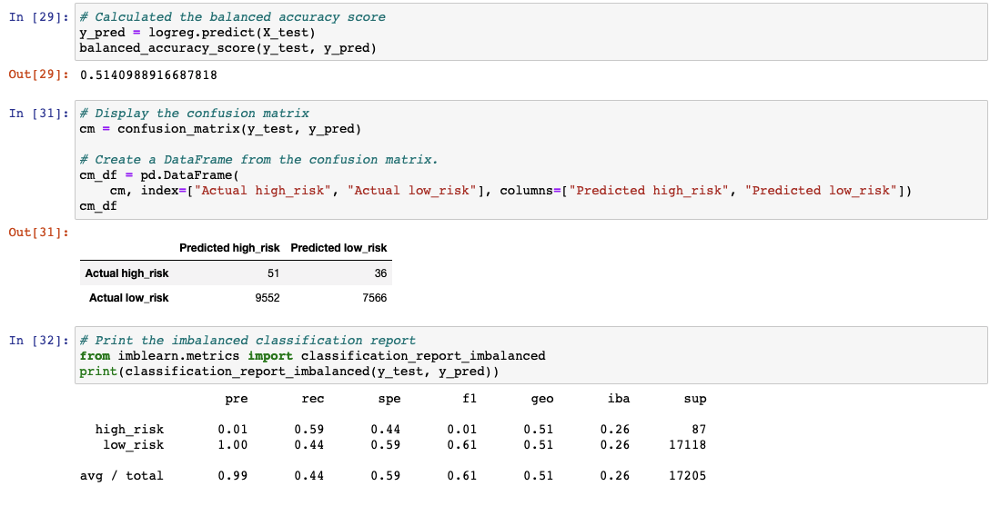
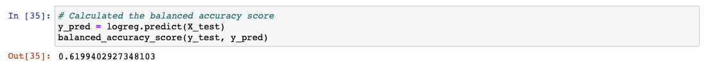
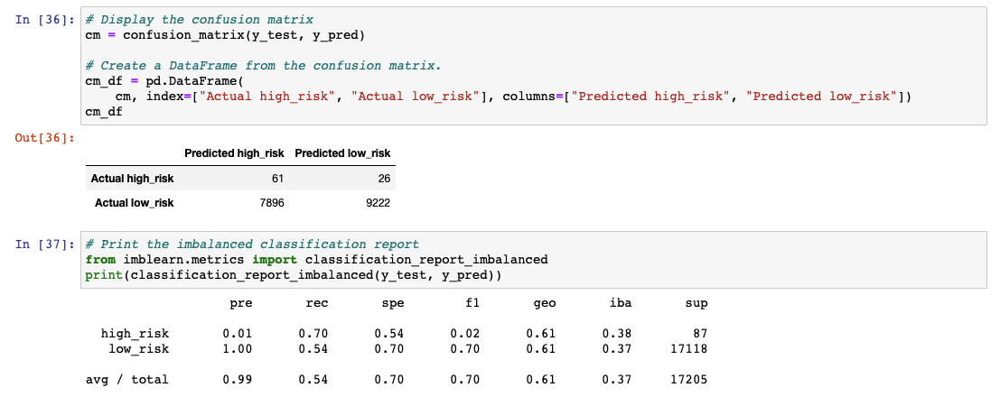
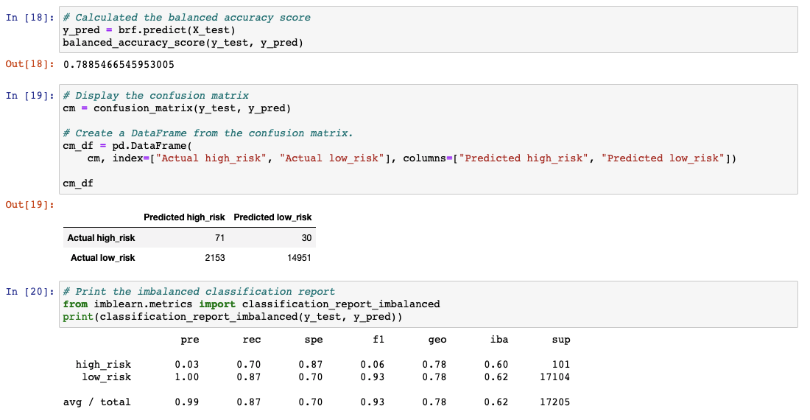
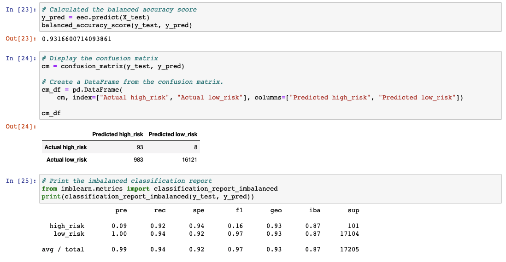

# Credit_Risk_Analysis
---

## Overview

The aim of the paper is to look at credit risk and employ different techniques to train and evaluate models with unbalanced classes. It will use imbalanced-learn and scikit-learn libraries to build and evaluate models using resampling.

### Aim

The aim of this paper is to used six machine learning models to analyise and predict credit risk, using the credit card dataset from LendingClub. The models are: 
- RandomOverSampler
- SMOTE
- ClusterCentroids
- SMOTEENN
- BalancedRandomForestClassifier
- EasyEnsembleClassifier

---
## Analysis and Results 

### RandomOverSampler

- Balanced Accuracy:64%
- High Risk Precision:1%
- High Risk Sensitivity:63%
- High Risk F1 Score:2%
- Low Risk Precision:100%
- Low Risk Sensitivity:64%
- Low Risk F1 Score:78%

 

### SMOTE

- Balanced Accuracy:64%
- High Risk Precision:1%
- High Risk Sensitivity:62%
- High Risk F1 Score:2%
- Low Risk Precision:100%
- Low Risk Sensitivity:66%
- Low Risk F1 Score:79%

 

### ClusterCentroids

- Balanced Accuracy:51%
- High Risk Precision:1%
- High Risk Sensitivity:59%
- High Risk F1 Score:1%
- Low Risk Precision:100%
- Low Risk Sensitivity:44%
- Low Risk F1 Score:61%

 

### SMOTEENN

- Balanced Accuracy:62%
- High Risk Precision:1%
- High Risk Sensitivity:70%
- High Risk F1 Score:2%
- Low Risk Precision:100%
- Low Risk Sensitivity:54%
- Low Risk F1 Score:70%

 

### BalancedRandomForestClassifier

- Balanced Accuracy:79%
- High Risk Precision:3%
- High Risk Sensitivity:70%
- High Risk F1 Score:6%
- Low Risk Precision:100%
- Low Risk Sensitivity:87%
- Low Risk F1 Score:93%

 

### EasyEnsembleClassifier

- Balanced Accuracy:93%
- High Risk Precision:9%
- High Risk Sensitivity:92%
- High Risk F1 Score:16%
- Low Risk Precision:100%
- Low Risk Sensitivity:94%
- Low Risk F1 Score:97%

---
## Summary

In summary, 
It is recommended that 
